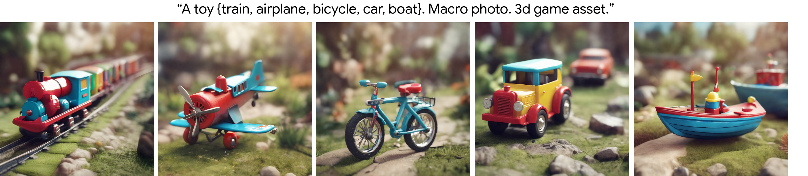
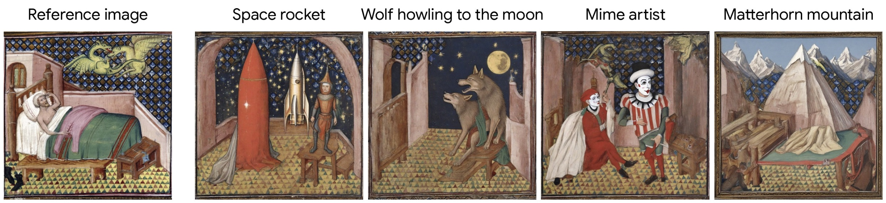
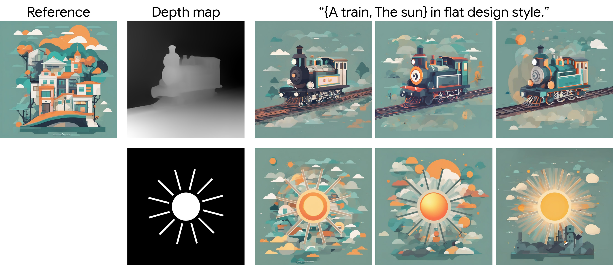
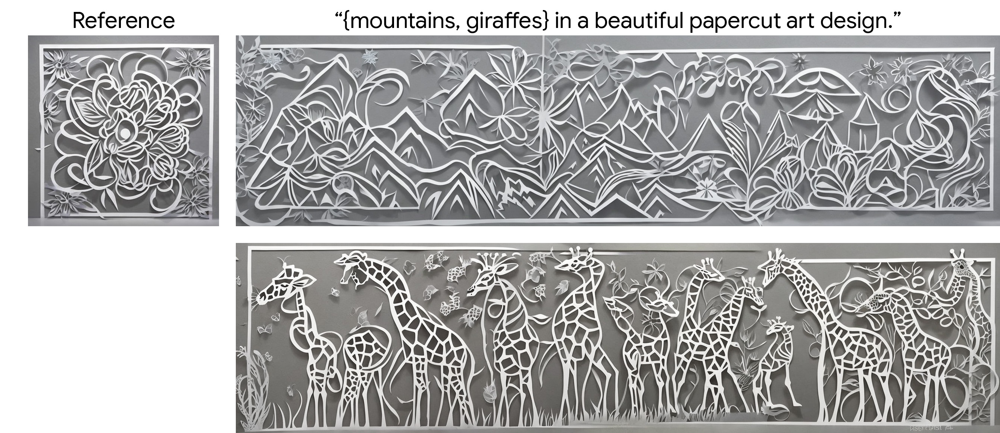

# Style Aligned Image Generation via Shared Attention


### [Project Page](https://style-aligned-gen.github.io) &ensp; [Paper](https://style-aligned-gen.github.io/data/StyleAligned.pdf)


## Setup

This code was tested with Python 3.11, [Pytorch 2.1](https://pytorch.org/)  and [Diffusers 0.16](https://github.com/huggingface/diffusers).

## Examples
- See [**style_aligned_sdxl**][style_aligned] notebook for generating style aligned images using [SDXL](https://huggingface.co/docs/diffusers/using-diffusers/sdxl).



- See [**style_aligned_transfer_sdxl**][style_aligned_transfer] notebook for generating images with a style from reference image using [SDXL](https://huggingface.co/docs/diffusers/using-diffusers/sdxl).



- See [**style_aligned_w_controlnet**][controlnet] notebook for generating style aligned and depth conditioned images using SDXL with [ControlNet-Depth](https://arxiv.org/abs/2302.05543).




-  [**style_aligned_w_multidiffusion**][multidiffusion] can be used for generating style aligned panoramas using [SD V2](https://huggingface.co/stabilityai/stable-diffusion-2) with [MultiDiffusion](https://multidiffusion.github.io/).



## Demos
Thanks to @yvrjsharma for preparing the demos: [**style aligned text to image**][style_aligned_demo],  [**ControlNet + StyleAligned**][controlnet_demo] and  [**MultiDiffusion + StyleAligned**][controlnet_demo]

To start a demo locally, simply run
```
python <demo file name>.py  
```
and enter the demo in your browser using the provided url.

An online demo of ControlNet + StyleAligned is available [here](https://huggingface.co/spaces/ysharma/style-aligned-controlnet).

## TODOs
- [x] Adding demo.
- [x] StyleAligned from an input image.
- [ ] Multi-style with MultiDiffusion.
- [ ] StyleAligned with DreamBooth

## Disclaimer
This is not an officially supported Google product.

[style_aligned]: style_aligned_sdxl.ipynb
[controlnet]: style_aligned_w_controlnet.ipynb
[multidiffusion]: style_aligned_w_multidiffusion.ipynb
[style_aligned_transfer]: style_aligned_transfer_sdxl.ipynb
[style_aligned_demo]: demo_stylealigned_sdxl.py
[controlnet_demo]: demo_stylealigned_controlnet.py
[multidiffusion_demo]: demo_stylealigned_multidiffusion.py
